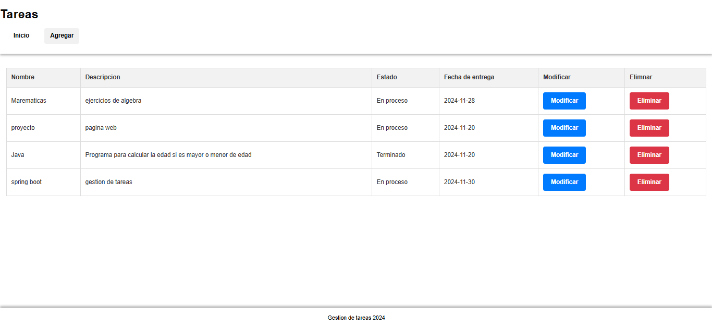
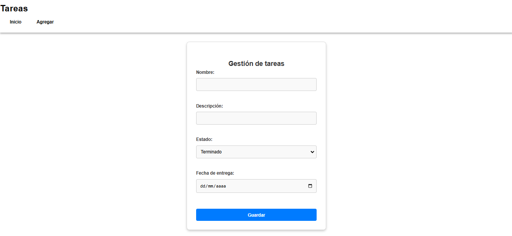

<<<<<<< HEAD
# Gesti-n-de-tareas-
Aplicación web desarrollada con Spring Boot que permite gestionar proyectos, incluyendo funcionalidades como creación, edición, eliminación y listado de tareas. Implementación de un CRUD completo con validación, manejo de bases de datos en PostgreSQL y una interfaz responsiva diseñada con HTML y CSS
=======
# Sistema de Gestión de Proyectos

Este proyecto es una aplicación web diseñada para gestionar proyectos de manera eficiente. Permite a los usuarios crear, editar, eliminar y listar proyectos a través de una interfaz sencilla y amigable.

## Capturas de pantalla

### Pantalla principal


### Formulario de creación/edición


---

## Tecnologías utilizadas

- **Backend**: Spring Boot, JPA, Jakarta Validation
- **Base de datos**: PostgreSQL
- **Frontend**: Thymeleaf, HTML, CSS
- **Gestión del proyecto**: Maven
- **Librerías adicionales**: Lombok

---

## Cómo ejecutar el proyecto localmente

### Prerrequisitos

Asegúrate de tener instalados los siguientes programas en tu computadora:
- [Java 17](https://www.oracle.com/java/technologies/javase-downloads.html)
- [Maven](https://maven.apache.org/)
- [PostgreSQL](https://www.postgresql.org/)
- Un IDE como [IntelliJ IDEA](https://www.jetbrains.com/idea/) o [Visual Studio Code](https://code.visualstudio.com/)

### Configuración de la base de datos

1. Crea una base de datos en PostgreSQL con el nombre `gestion_proyectos`.
2. Actualiza las credenciales de conexión en el archivo `application.properties`:
    ```spring.datasource.url=jdbc:postgresql://localhost:5432/gestion_proyectos
       spring.datasource.username=tu nombre
       spring.datasource.password=tu contraseña
       spring.datasource.driver-class-name=org.postgresql.Driver
       spring.jpa.properties.hibernate.dialect=org.hibernate.dialect.PostgreSQLDialect
       spring.jpa.hibernate.ddl-auto=update
    ```

### Pasos para ejecutar

1. Clona este repositorio:
   ```bash
   git clone https://github.com/tuusuario/sistema-gestion-proyectos.git
2. Ve al directorio del proyecto:   
   cd sistema-gestion-proyectos
3. Compila y ejecuta el proyecto con Maven:
   mvn spring-boot:run
4. Abre tu navegador y accede a http://localhost:8080.

### Dependencias necesarias
Las dependencias principales están definidas en el archivo pom.xml. Aquí están las más relevantes:

Spring Boot Starter Data JPA: Manejo de datos y ORM.
Spring Boot Starter Web: Desarrollo de aplicaciones web.
PostgreSQL Driver: Conexión a la base de datos PostgreSQL.
Lombok: Para reducir el boilerplate de código.
Jakarta Validation: Validaciones de datos en formularios.

### Contacto
Si tienes alguna pregunta o sugerencia sobre este proyecto, no dudes en contactarme: 
📧 jeinerperezp@gmail.com
📱 +57 3204387147


>>>>>>> 0b71204 (Subida inicial del proyecto)
